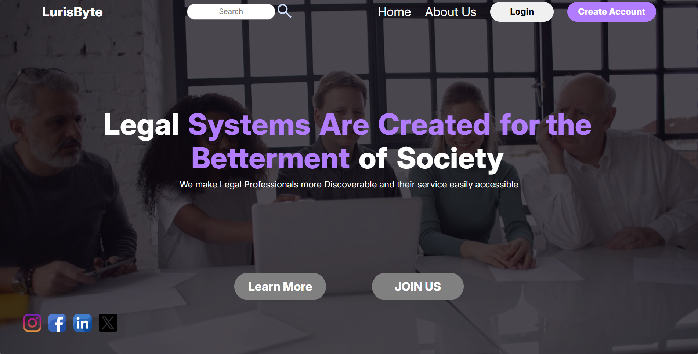
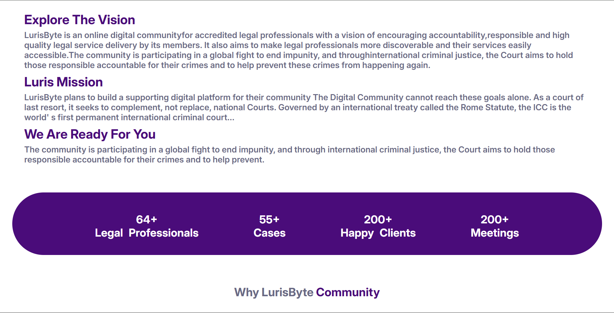
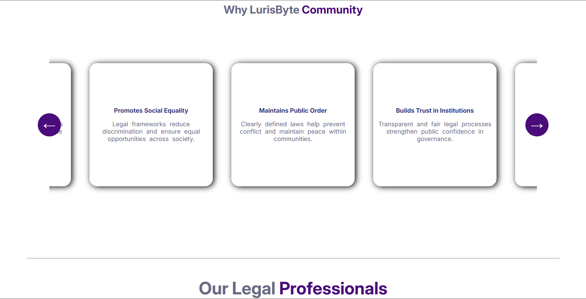
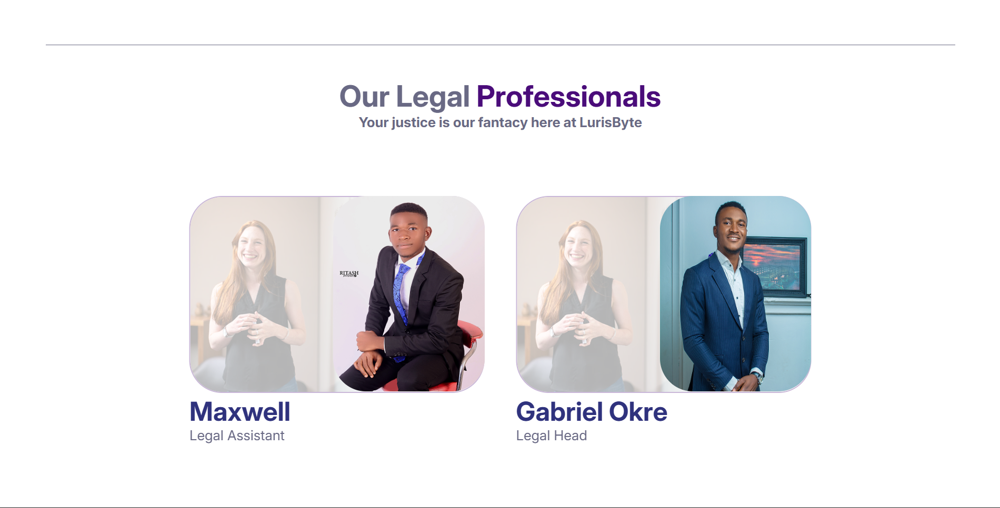
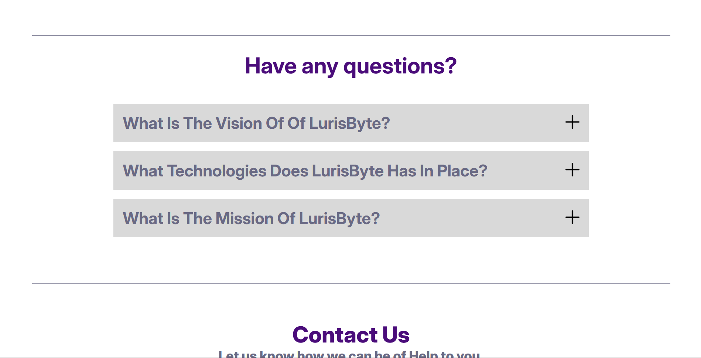
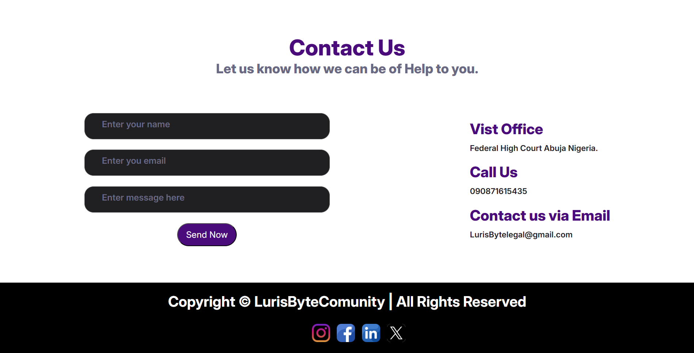
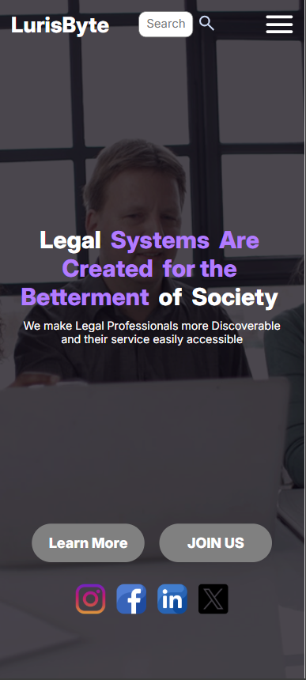
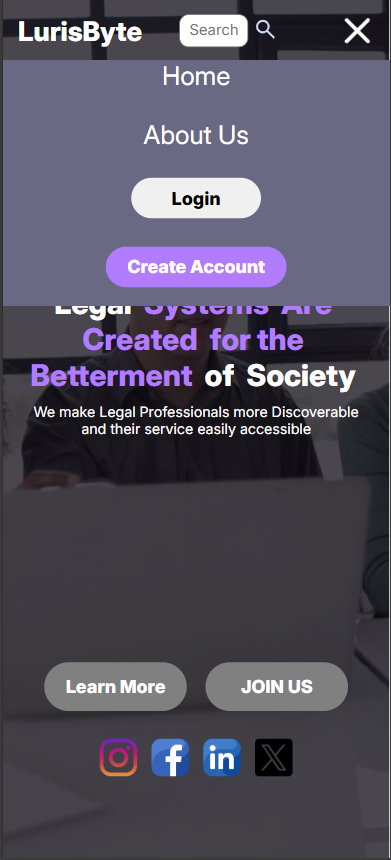
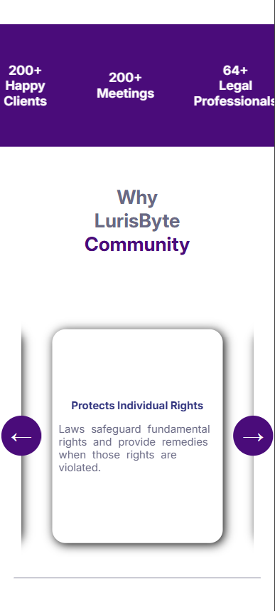
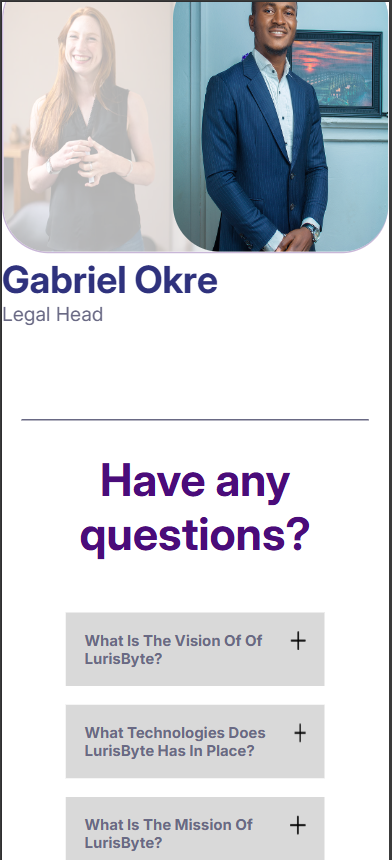

# Business Website – Responsive Frontend Project

## Overview

A clean, responsive business website built using HTML, CSS, and vanilla JavaScript.
Designed to represent real-world agency or startup requirements.

## Features

- Mobile-first responsive design
- Modern UI layout
- Services showcase
- Deployed live on Netlify

## Tech Stack

- HTML5
- CSS3 (Flexbox, Grid)
- JavaScript (ES6)

## Live Demo

<https://business-website-rago.netlify.app>

## Screenshots

### Desktop View

**Hero Section**  

**About / Vision Section**  

**Community / Services Section**  

**Team Section**  

**FAQ Section**  

**Contact Section**  

---

### Mobile View (Responsive Design)

**Mobile Navigation**  

**Mobile Hero Section**  

**Mobile Community Section**  

**Mobile FAQ Section**  

## Author

Raghav
